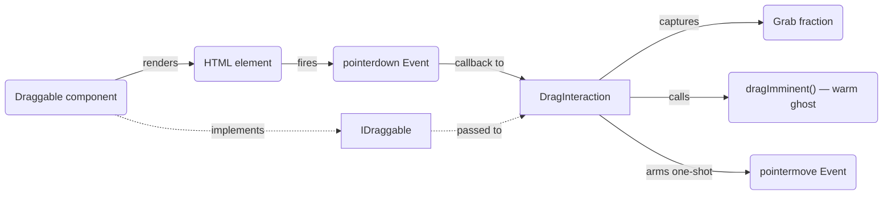
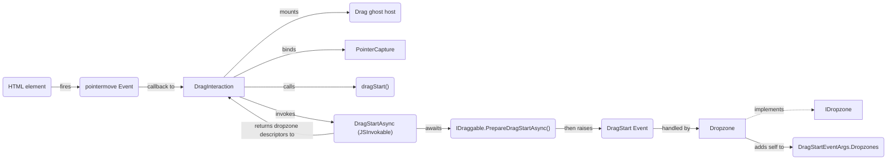
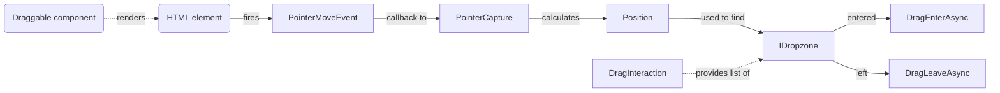
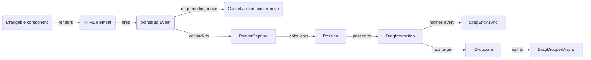
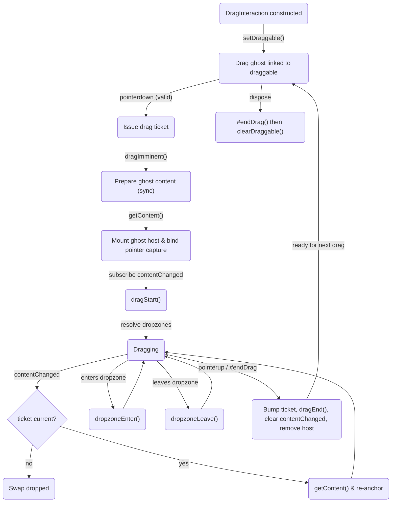
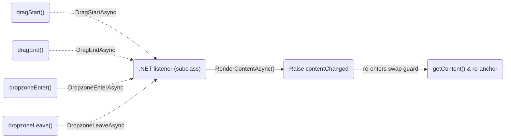

# Draggable

[[_TOC_]]

## Introduction

This document guides through the implementation of a drag and drop operation.

## Flow chart

> The [`Dropzone`](../../../samples/Shared/Pages/Draggable/Components/Dropzone.razor.cs) component is used exemplarily. Any other component implementing [`IDropzone`](Components/IDropzone.cs) could be used instead.

### Pointer down (drag warm-up)

> A `pointerdown` does not start the drag. It only captures the grab anchor (as a fraction of the dragged element's size), warms the drag ghost via `dragImminent()`, and arms a **one-shot** `pointermove`. This way a plain click never produces a ghost: the drag begins on the first qualifying move (see next chart), and a `pointerup` without a move cancels the armed move.



### First pointer move (drag start)

> The drag begins on the first `pointermove` after a valid `pointerdown`. `DragInteraction` mounts the ghost host, binds pointer capture, calls `dragStart()` on the drag ghost, and invokes `DragStartAsync` on the .NET side. That first awaits the draggable's `IDraggable.PrepareDragStartAsync()`, then raises the `DragStart` event; each handling `IDropzone` adds itself to `DragStartEventArgs.Dropzones`, and the resolved dropzone descriptors are returned to the JavaScript side for hit-testing. The ghost follows the pointer before any of this, so a slow preparation delays only when the dropzones become known, never the drag itself.



### Subsequent pointer moves



### Pointer up (drag end)

> A `pointerup` without any preceding move cancels the armed `pointermove` so a plain click never drags. Once the drag has started, `DragInteraction` calls `DragEndAsync` on every dropzone, even when the pointer is released before the drag ghost moves, and `DragDroppedAsync` on the dropzone under the pointer (if any).



### Drag ghost lifecycle

> The drag ghost (`ResolvedDragGhost`) is the element that follows the pointer. `DragInteraction` drives it through a set of optional callbacks; any callback that is not implemented is skipped. The `setDraggable` link is established once at construction and only released on `dispose`, so it survives every `#endDrag` and keeps repeated drags working. A per-drag ticket guards asynchronous content swaps: a swap tagged with a stale ticket is dropped once the drag ends and the ticket is bumped.



#### `DragGhostBase` callback wiring

> When the ghost is authored as Blazor markup via `DragGhostBase`, the callbacks above are the JavaScript half.



## Implementation

### Implement draggable component

- Create razor component
- Implement [`IDraggable`](Components/IDraggable.cs)
- Inject [`IDragInteraction`](Services/IDragInteraction.cs)
- Call `IDragInteraction.AttachAsync` when drag interaction should be allowed, normally this would be done in `OnAfterRenderAsync` when `IDraggable.Draggable` is `true`
- Call `IDragInteraction.RemoveAsync` when drag interaction should be removed, normally this would be done in `OnParametersSetAsync` when `IDraggable.Draggable` has changed from `true` to `false`

> The [`Shape`](../../../samples/Shared/Pages/Draggable/Components/Shape.razor.cs) component can be taken as a template to get started.

#### Prepare the drag start

Often a dropzone needs to decide at drag start whether to take part on a drag, often from what the draggable carries. When that state is only settled once the drag starts, and possibly asynchronously, implement `IDraggable.PrepareDragStartAsync()`: `DragInteraction` awaits it before it raises `DragStart`, so every dropzone already sees the settled state. It does nothing unless implemented.

```csharp
public async Task PrepareDragStartAsync()
{
    Payload = await PayloadService.ResolveAsync(Id);
}
```

A failing preparation is logged, and the dropzones are resolved against the unprepared draggable.

> The [`TicketDispenser`](../../../samples/Shared/Pages/Draggable/Components/TicketDispenser.razor.cs) sample hands out the next ticket after a delay whenever a drag starts; only the dropzone serving that ticket lights up.

### Implement dropzone

- Create razor component
- Implement [`IDropzone`](Components/IDropzone.cs)
- Inject [`IDragInteraction`](Services/IDragInteraction.cs)
- Add event handler for `IDragInteraction.DragStart`, in this handler add the component to `DragStartEventArgs.Dropzones` to participate in the drag

> The [`Dropzone`](../../../samples/Shared/Pages/Draggable/Components/Dropzone.razor.cs) component can be taken as a template to get started.

## Ghost customization

While dragging, a **ghost element** follows the pointer. By default it is a deep copy of the dragged element (the *default drag ghost*), positioned over it. To customize it, pass a **drag ghost** — an optional [`IDragGhost`](Abstractions/IDragGhost.cs) — to `AttachAsync`.

> The ghost element is mounted synchronously when a valid `pointerdown` occurs, before the dropzones are known, into a stable *ghost host* ([`DragGhostHost`](Scripts/DragGhostHost.ts)) that `DragInteraction` binds pointer capture to. A drag ghost may push newer ghost content afterwards (via `contentChanged`); `DragInteraction` swaps it into the host. The ghost element is cosmetic: on any drag-ghost failure the drag continues with the default drag ghost and the error is logged; the drag is never blocked.

A drag ghost is kind-blind to `DragInteraction`: its single [`GetJsModule()`](Abstractions/IDragGhost.cs) returns a [`DragGhostJsModuleDescriptor`](Models/DragGhostJsModuleDescriptor.cs) (a JavaScript `ModuleName` plus a `CreateFunction` descriptor). JavaScript imports the module once per attach and calls its `createDragGhost` export to obtain the runtime [`ResolvedDragGhost`](Scripts/ResolvedDragGhost.ts) (required `getContent`, plus opt-in lifecycle callbacks). Whether the ghost element is backed

### Default drag ghost

Pass no `dragGhost` to `AttachAsync`. The ghost element is a deep copy of the dragged element ([`DefaultDragGhost`](Scripts/DefaultDragGhost.ts)) and stays aligned over it. The forms below anchor the grabbed fraction of the element under the pointer instead.

### Markup drag ghost via `DragGhostBase`

Use when the ghost element is authored as Blazor markup. Create a component that **subclasses [`DragGhostBase`](Components/DragGhostBase.cs)**, render a [`DragGhostContent`](Components/DragGhostContent.razor), and bind it with `@ref="Content"`. `DragGhostContent` renders its content as part of the normal Blazor render cycle, so it always reflects the current content and the content is ready to be swapped into the ghost. Place it in **render-stable** markup and pass it (`@ref`) as `dragGhost`:

```razor
@inherits DragGhostBase

<DragGhostContent @ref="Content">
    <MonochromeIcon Name="MonochromeIconName.Folder" Size="MonochromeIconSize.Medium" />
</DragGhostContent>
```

```razor
<MyDragGhost @ref="_dragGhost" />

@code {
    private MyDragGhost? _dragGhost;
}
```

```csharp
await DragInteraction.AttachAsync(this, dragGhost: _dragGhost);
```

`DragGhostBase` subclasses must be placed in **render-stable** markup:

#### Drag lifecycle opt-ins

A `DragGhostBase` subclass can opt into drag lifecycle callbacks by implementing either interface — no round-trip is made for a callback that is not implemented:

| Interface | Callback |
|-|-|
| [`IDragStartListener`](Abstractions/IDragStartListener.cs) | `Task DragStartAsync()` — a drag starts. |
| [`IDragEndListener`](Abstractions/IDragEndListener.cs) | `Task DragEndAsync()` — a drag ends. |
| [`IDropzoneEnterListener`](Abstractions/IDropzoneEnterListener.cs) | `Task DropzoneEnterAsync()` — a drag enters a dropzone. |
| [`IDropzoneLeaveListener`](Abstractions/IDropzoneLeaveListener.cs) | `Task DropzoneLeaveAsync()` — a drag leaves a dropzone. |

The [`TimeTickerDragGhost`](../../../samples/Shared/Pages/Draggable/Components/TimeTickerDragGhost.razor) sample implements both.

`RenderContentAsync()` is the single trigger for updating the ghost: it re-renders the content and, once the render completes, the fresh content is swapped into the live ghost whenever a drag is in progress (and is a no-op otherwise). This works the same wherever the render comes from — a lifecycle callback (`DragStartAsync`, `DropzoneEnterAsync`, `DropzoneLeaveAsync`) or outside one, such as a timer that calls `RenderContentAsync()` every second.

Rather than have .NET call into JavaScript, the JavaScript ghost *pulls*: for the duration of a drag it keeps a `WaitForContentChangeAsync()` interop call pending on the .NET ghost, which completes it whenever content is rendered. The ghost then re-fetches and swaps the content and immediately waits again. This keeps the ghost element driven entirely by JavaScript calling into .NET, never the other way around, so `DragGhostBase` needs no `IJSRuntime` dependency.

The [`TimeTickerDragGhost`](../../../samples/Shared/Pages/Draggable/Components/TimeTickerDragGhost.razor) sample uses a timer to keep its clock ticking while it is being dragged.

#### Cursor

The cursor shown during the drag is the CSS `cursor` of the first element inside `DragGhostContent`, declared in the component's own scoped stylesheet like any other style. It follows every `RenderContentAsync()`, so switching a CSS class from `DropzoneEnterAsync` / `DropzoneLeaveAsync` switches the cursor:

```scss
.my-drag-ghost {
    cursor: not-allowed;

    &.over-dropzone {
        cursor: alias;
    }
}
```

Without a cursor of its own, the document's cursor stays.

Styling the content alone would not show: pointer capture is bound to the ghost host, and a captured pointer shows the cursor of the capturing element. The ghost therefore exposes the opt-in `getCursor()` ([`DragGhostCursorSource`](Scripts/DragGhostCursorSource.ts)), which `DragInteraction` applies to the host each time it sets the content. The cursor is read from the rendered source content, not from the clone, since only the source keeps the component's scoped CSS. The default drag ghost and the table-row drag ghost don't implement it: their content is a copy of the dragged element, which carries that element's own cursor.

##### How opt-in is wired

The JavaScript side of a `DragGhostBase` ghost lives in the [`DragGhostBase.cs.ts`](Components/DragGhostBase.cs.ts) companion module, which exposes **one central factory** that returns a single stateful drag ghost instance:

| Factory export | Instance members |
|-|-|
| `createDragGhost` | Returns one stateful instance holding the host element and .NET reference. `getContent` (required) provides the class-stripped element clone; `dragStart` / `dragEnd` (opt-in) forward the drag-start / drag-end callbacks (`DragStartAsync` / `DragEndAsync`) and `dropzoneEnter` / `dropzoneLeave` (opt-in) forward the dropzone-enter / dropzone-leave callbacks (`DropzoneEnterAsync` / `DropzoneLeaveAsync`). The .NET listener renders the content itself via `RenderContentAsync()`; the ghost's pending `WaitForContentChangeAsync()` call then resolves and raises `contentChanged` to swap the fresh content into the ghost. |

Because the callbacks are methods on a single instance, state can be held across `getContent`, `dragStart`, `dragEnd`, `dropzoneEnter`, and `dropzoneLeave` for the whole drag.

Opt-in is driven by the deriving component: the `createDragGhost` factory exposes a lifecycle callback on the returned instance **only when the subclass implements the matching interface** (passed to the factory via the create args). `DragInteraction` then **feature-detects** the exposed callbacks on the instance, so an unimplemented callback is never present and makes no round-trip. `DragInteraction` creates the instance once per attach and calls only the callbacks the instance actually exposes.

### Pure-JavaScript drag ghost

Use when the ghost element needs live DOM access — for example copying the rendered width and height of a dragged `<tr>`. A pure-JavaScript drag ghost is one `.ts` module exporting `createDragGhost` (returning a `ResolvedDragGhost`) plus an `IDragGhost` class holding its module descriptor:

```csharp
public sealed class MyDragGhost : IDragGhost
{
    public DragGhostJsModuleDescriptor GetJsModule()
        => new()
        {
            ModuleName = "./_content/MyApp/my-drag-ghost.js",
            CreateFunction = new() { Name = "createDragGhost" }
        };
}
```

```csharp
await DragInteraction.AttachAsync(this, dragGhost: new MyDragGhost());
```

A built-in drag ghost for table rows is provided: [`ITableRowDragGhost`](Services/ITableRowDragGhost.cs). It makes the ghost element its own table box and pins each cell to the original cell's rendered width. Register it with `AddDraggable()`, inject `ITableRowDragGhost`, and pass it as `dragGhost`:

```csharp
@inject ITableRowDragGhost TableRowDragGhost

@code {
    // ...
    await DragInteraction.AttachAsync(this, dragGhost: TableRowDragGhost);
}
```

### Registration

| Helper | Registers |
|-|-|
| `AddDraggable()` | `IDragInteraction` — required for any drag interaction. `ITableRowDragGhost` — the built-in table-row drag ghost. |
