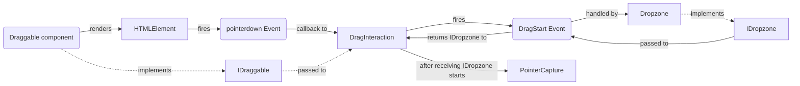
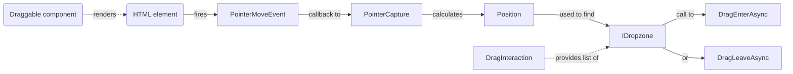
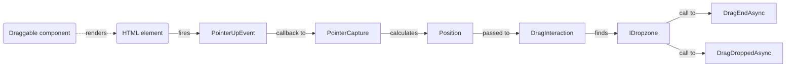

# Draggable

[[_TOC_]]

## Introduction

This document guides through the implementation of a drag and drop operation.

## Flow chart

> The [`Dropzone`](../../../samples/Shared/Pages/Draggable/Components/Dropzone.razor.cs) component is used exemplarily. Any other component implementing [`IDropzone`](Components/IDropzone.cs) could be used instead.

### Mouse down / drag start

### After drag start / mouse move

### Mouse up / drag end

## Implementation

### Implement draggable component

- Create razor component
- Implement [`IDraggable`](Components/IDraggable.cs)
- Inject [`IDragInteraction`](Services/IDragInteraction.cs)
- Call `IDragInteraction.AttachAsync` when drag interaction should be allowed, normally this would be done in `OnAfterRenderAsync` when `IDraggable.Draggable` is `true`
- Call `IDragInteraction.RemoveAsync` when drag interaction should be removed, normally this would be done in `OnParametersSetAsync` when `IDraggable.Draggable` has changed from `true` to `false`

> The [`Shape`](../../../samples/Shared/Pages/Draggable/Components/Shape.razor.cs) component can be taken as a template to get started.

### Implement dropzone

- Create razor component
- Implement [`IDropzone`](Components/IDropzone.cs)
- Inject [`IDragInteraction`](Services/IDragInteraction.cs)
- Add event handler for `IDragInteraction.DragStart`, in this handler add the component to `DragStartEventArgs.Dropzones` to participate in the drag

> The [`Dropzone`](../../../samples/Shared/Pages/Draggable/Components/Dropzone.razor.cs) component can be taken as a template to get started.
