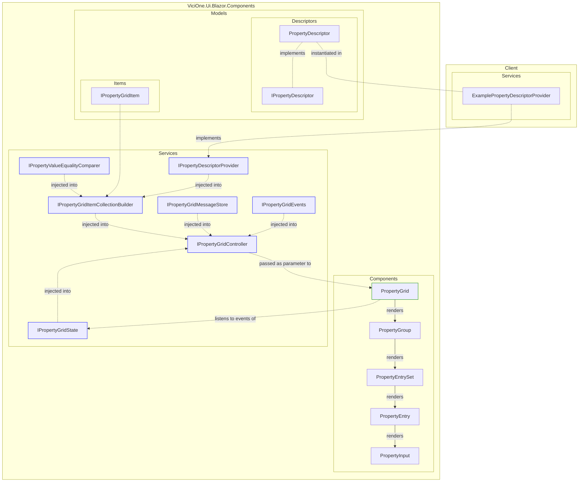

# PropertyGrid (experimental)

[[_TOC_]]

## Introduction

The property grid is composed of individual components and services as shown in the following diagram.

**It is in an experimental stage and must be considered subject to change or removal in future updates
until the experimental label is removed.**



## Get started

### 1. Add context class

``` csharp
public sealed class ExamplePropertyGridContext
{
    public required string Subject { get; init; } // exemplary property to describe context
}
```

> Alternatively, you can use any existing class that represents the property context.

### 2. Describe properties

``` csharp
using ViciOne.Ui.Blazor.Components.PropertyGrid.Services;

internal sealed class ExampleInstancePropertyDescriptorProvider
    : IPropertyDescriptorProvider<ExamplePropertyGridContext, ExampleInstance>
{
    public IEnumerable<IPropertyDescriptor<ExampleInstance>> GetPropertyDescriptors(ExamplePropertyGridContext context)
    {
        yield return new PropertyDescriptor<ExampleInstance, string>()
        {
            Category = "String properties",
            Name = nameof(ExampleInstance.Description),
            DisplayName = $"{context.Subject} {nameof(ExampleInstance.Description)}",
            GetValue = (instance) => ExampleInstance.Description,
            SetValue = (instance, value) => instance.Description = value
        };

        ...
    }
}
```

> This provider describe the property `Description` of an imaginary class `ExampleInstance`.

### 3. Register minimal services

``` csharp
services.AddPropertyGrid<ExamplePropertyGridContext>()
  .WithPropertyDescriptorProvider<ExampleInstancePropertyDescriptorProvider>();
```

### 3. Render property grid

``` html
@* AnyComponent.razor *@

@using ViciOne.Ui.Blazor.Components.PropertyGrid.Services

@inject IPropertyGridController<ExamplePropertyGridContext> PropertyGridController

<PropertyGrid Controller="PropertyGridController" />
```

### 4. Set instances

``` csharp
ExampleInstance _instance1 = new();
ExampleInstance _instance2 = new();

PropertyGridController.SetInstance([_instance1, _instance2], new ExamplePropertyGridContext { Subject = "Foo" });
```

### 5. Add TooltipDisplay

- Add `TooltipDisplay` component to your application at a central place (e.g. in `MainLayout.razor`)

  ``` html
  @using ViciOne.Ui.Blazor.Components.Tooltip.Components

  <TooltipDisplay />
  ```
